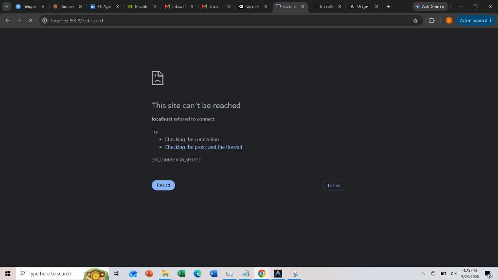

# End-to-End System Architecture
**Project:** AI Insurance Inbox Triage Agent
**Last Updated:** 2026-09-24
**Status:** Production-validated (Step 6 Tier B complete)

---

## High-Level Architecture Diagram

```
┌─────────────────────────────────────────────────────────────────────────────┐
│                        EXTERNAL WORLD                                       │
│                                                                             │
│   Customer Email  ──────────────────────────────►  Gmail Inbox (IMAP)      │
│   (insurance query, claim, complaint, etc.)         tester@example.com      │
│                                                                             │
│   Human Reviewer  ◄─────────────────────────────  Telegram Bot             │
│   (Approval / Reject)  ─────────────────────────►  (your_telegram_bot)          │
│                                                                             │
│   Approved Reply  ──────────────────────────────►  Customer (SMTP/Gmail)   │
└─────────────────────────────────────────────────────────────────────────────┘
                              │ IMAP Poll (every 60s)
                              ▼
┌─────────────────────────────────────────────────────────────────────────────┐
│                    n8n ORCHESTRATION LAYER (Docker)                         │
│                                                                             │
│  ┌──────────────────────────────────────────────────────────────────────┐  │
│  │ WORKFLOW 04 — Email Ingestion Orchestrator (InsTriageOrch04)         │  │
│  │                                                                      │  │
│  │  IMAP Fetch                                                          │  │
│  │      │                                                               │  │
│  │      ▼                                                               │  │
│  │  ┌─────────────────────────────────────────┐                        │  │
│  │  │ Deduplication Check (ADR-022)          │                        │  │
│  │  │ (SQLite: processed_emails read-only)  │                        │  │
│  │  │ duplicate=true  → Stop (0 Jev tokens) │                        │  │
│  │  │ duplicate=false → Proceed to Jev gate │                        │  │
│  │  └─────────────────────────────────────────┘                        │  │
│  │      │ new email only                                                │  │
│  │      ▼                                                               │  │
│  │  ┌─────────────────────────────────────────┐                        │  │
│  │  │ JEV PRE-FILTER GATE (ADR-021 / ADR-022)  │  ◄── Jev API          │  │
│  │  │  is_insurance: yes/uncertain → proceed  │      (TypeSafe AI)     │  │
│  │  │  is_insurance: no → Mark Skipped ('Ignored')                      │  │
│  │  └─────────────────────────────────────────┘                        │  │
│  │      │ yes / uncertain                                               │  │
│  │      ▼                                                               │  │
│  │  Customer Context Lookup                                             │  │
│  │  (SQLite: customers, policies, claims tables)                        │  │
│  │      │                                                               │  │
│  │      ▼                                                               │  │
│  │  ┌────────────────────────────────────────┐                         │  │
│  │  │ SUBWORKFLOW 01 — Classify & Guardrail  │                         │  │
│  │  │  (InsTriageSubWf01)                    │                         │  │
│  │  │                                        │                         │  │
│  │  │  Inception Mercury-2.5 LLM  ◄────────────── INCEPTION_API_KEY   │  │
│  │  │  (classify intent, draft reply)        │      (env var)          │  │
│  │  │      │                                 │                         │  │
│  │  │      ▼                                 │                         │  │
│  │  │  Fail-Safe Circuit Breaker             │                         │  │
│  │  │  (is_llm_failure → AUTO_ESCALATED)     │                         │  │
│  │  │      │                                 │                         │  │
│  │  │      ▼                                 │                         │  │
│  │  │  SQLite Guardrail Check                │                         │  │
│  │  │  (policy/claim existence + amount)     │                         │  │
│  │  │  PASSED → proceed                      │                         │  │
│  │  │  REJECTED → escalate (no email sent)   │                         │  │
│  │  └────────────────────────────────────────┘                         │  │
│  │      │ PASSED + draft ready                                          │  │
│  │      ▼                                                               │  │
│  │  Write to SQLite: triage_results                                     │  │
│  │  (approval_status = PENDING)                                         │  │
│  │      │                                                               │  │
│  │      ▼                                                               │  │
│  │  ┌────────────────────────────────────────┐                         │  │
│  │  │ SUBWORKFLOW 02 — Telegram Approval     │                         │  │
│  │  │  (InsTriageSubWf02)                    │                         │  │
│  │  │                                        │                         │  │
│  │  │  Send Telegram approval card           │ ◄── TELEGRAM_BOT_TOKEN │  │
│  │  │  (intent, draft, policy info)          │      (env var)          │  │
│  │  │      │                                 │                         │  │
│  │  │      ▼ Human clicks APPROVE/REJECT     │                         │  │
│  │  │  Webhook callback received             │                         │  │
│  │  │      │                                 │                         │  │
│  │  │    APPROVE → POST /api/v1/triage/      │                         │  │
│  │  │              dispatch-email            │                         │  │
│  │  │              → SMTP send               │ ◄── SMTP_USER/PASS     │  │
│  │  │              → Card: ✅ APPROVED & SENT│      (env var)          │  │
│  │  │    REJECT  → Card: ❌ REJECTED         │                         │  │
│  │  │              No SMTP send              │                         │  │
│  │  └────────────────────────────────────────┘                         │  │
│  └──────────────────────────────────────────────────────────────────────┘  │
│                                                                             │
│  ┌──────────────────────────────────────────────────────────────────────┐  │
│  │ WORKFLOW 03 — SLA Escalation Cron (InsTriageSLACron03)              │  │
│  │  Runs every 5 min. Finds PENDING > 2h → AUTO_ESCALATED.            │  │
│  │  Sends Telegram alert to reviewer.                                  │  │
│  └──────────────────────────────────────────────────────────────────────┘  │
└─────────────────────────────────────────────────────────────────────────────┘
                              │
                              ▼
┌─────────────────────────────────────────────────────────────────────────────┐
│                    FastAPI BACKEND (Docker)                                  │
│                    api/main.py | port 8008                                  │
│                                                                             │
│  Endpoints:                                                                 │
│  POST /api/v1/triage/classify      ← (internal, called by SubWf01)         │
│  POST /api/v1/triage/approve       ← (called by SubWf02 on callback)       │
│  POST /api/v1/triage/dispatch-email← (called by SubWf02 on APPROVE)        │
│  GET  /api/v1/triage/status/{id}   ← (status lookup)                       │
│  GET  /api/v1/health               ← (liveness check)                      │
│  GET  /dashboard                   ← (public triage dashboard)             │
│                                                                             │
│  Business Logic:                                                            │
│  - Guardrail verify: cross-checks LLM output against SQLite                 │
│  - Dispatch: SMTP send via Gmail                                            │
│  - Audit trail: writes to triage_results + processed_emails                │
└─────────────────────────────────────────────────────────────────────────────┘
                              │
                              ▼
┌─────────────────────────────────────────────────────────────────────────────┐
│                    SQLite DATABASE (WAL mode)                               │
│                    db/insurance.db                                          │
│                                                                             │
│  Tables:                                                                    │
│  ├── customers          (id, name, email, phone, ...)                      │
│  ├── policies           (policy_number, customer_id, type, status, ...)    │
│  ├── claims             (claim_number, policy_number, amount, status, ...) │
│  ├── claim_documents    (doc_id, claim_number, doc_type, ...)              │
│  ├── payments           (payment_id, claim_number, amount, status, ...)    │
│  ├── renewals           (renewal_id, policy_number, due_date, ...)         │
│  ├── support_tickets    (ticket_id, customer_id, status, priority, ...)    │
│  ├── triage_results     (id, sender, subject, intent, guardrail_status,    │
│  │                       approval_status, reply_status, ...)               │
│  └── processed_emails   (message_id, sender, subject, processed_at,        │
│                          status: Processed|Skipped-NonInsurance|Duplicate) │
│                                                                             │
│  WAL Mode: journal_mode=WAL, synchronous=NORMAL, timeout=30s               │
└─────────────────────────────────────────────────────────────────────────────┘
```

---

## Web Operations Dashboard Console



The Ops Console UI (`http://localhost:8008/dashboard`) provides real-time visibility into incoming claims, critical emergencies, human escalations, guardrail verification states (`PASSED` vs `REJECTED`), desk routing, and reply status.

---

## Data Flow Summary

| Stage | Component | Output |
|---|---|---|
| 1. Email arrives | Gmail Inbox (IMAP) | Raw email fetched every 60s |
| 2. [Planned] Pre-filter | Jev Gate (ADR-021) | `yes/uncertain` → continue; `no` → skip |
| 3. Dedup | SQLite `processed_emails` | Skip if message_id already seen |
| 4. Context enrichment | SQLite customer/policy/claims | Customer profile attached to payload |
| 5. LLM triage | Inception Mercury-2.5 | intent, category, urgency, draft reply |
| 6. Fail-safe | Circuit breaker (n8n) | LLM failure → AUTO_ESCALATED, no draft |
| 7. Guardrail | SQLite verify + API | PASSED or REJECTED (hallucination check) |
| 8. Human review | Telegram Bot | Reviewer approves or rejects |
| 9. Dispatch | SMTP via Gmail | Reply sent; audit record updated |
| 10. SLA watch | Cron Workflow 03 | PENDING > 2h → escalation alert |

---

## Infrastructure (Docker Compose)

| Container | Image | Port | Role |
|---|---|---|---|
| `n8n` | n8nio/n8n | 5678 | Workflow orchestration |
| `api` | python:3.11 (custom) | 8008 | FastAPI triage backend |
| (shared volume) | — | — | SQLite DB + workflow JSONs |

---

## Key Environment Variables

| Variable | Used By | Purpose |
|---|---|---|
| `INCEPTION_API_KEY` | n8n SubWf01 | Primary LLM (Mercury-2.5) |
| `GOOGLE_API_KEY` | n8n SubWf01 (fallback) | Secondary LLM (Gemini, 20 RPD limit) |
| `TELEGRAM_BOT_TOKEN` | n8n SubWf02 | Approval cards |
| `TELEGRAM_CHAT_ID` | n8n SubWf02 | Reviewer chat |
| `SMTP_USER` | FastAPI dispatch | Gmail SMTP sender |
| `SMTP_PASS` | FastAPI dispatch | Gmail App Password |
| `JEV_API_KEY` | [Planned] n8n Wf04 | Jev pre-filter gate |
| `JEV_API_URL` | [Planned] n8n Wf04 | Jev endpoint |

---

## Decision Records Index

| ADR | Date | Subject |
|---|---|---|
| ADR-001 | 2026-09-23 | SQLite schema constraints & FK integrity |
| ADR-002 | 2026-09-23 | Email deduplication strategy |
| ADR-003 | 2026-09-23 | LLM provider selection (Gemini free tier) |
| ADR-004–017 | 2026-09-23 | See DECISIONS.md |
| ADR-018 | 2026-09-23/24 | SQLite WAL mode & backup strategy |
| ADR-019 | 2026-09-24 | Gemini 20 RPD limit; Inception Mercury-2.5 primary |
| ADR-020 | 2026-09-24 | n8n SubWf01 migration to Inception |
| ADR-021 | 2026-09-24 | Jev pre-filter gate plan (this system) |
| ADR-022 | 2026-09-24 | Jev Deduplication Token Optimization |
| ADR-023 | 2026-09-24 | Strict JEV Binary Filtering & Live Verification |
| ADR-024 | 2026-09-24 | Phase 2 JEV Priority Scoring & Phase 3 Semantic Policy Grounding |
| ADR-025 | 2026-09-24 | Fixing SMTP Dispatch and Guardrail Email Handling |
| ADR-026 | 2026-09-24 | Dashboard Public Exposure |
| ADR-027 | 2026-09-24 | Telegram Approval Sub-Workflow Bug Fixes |

Full records: `docs/DECISIONS.md`

---

## Validated Test Coverage (Step 6)

| Case | Type | Result |
|---|---|---|
| 32 synthetic (Tier A) | Inception Mercury-2.5 | 96.9% pass (31/32; 1 test data error) |
| Case 1: Happy Path | Tier B Live | ✅ ROADSIDE_ASSISTANCE → APPROVED & SENT |
| Case 2: Guardrail Rejection | Tier B Live | ✅ Fake policy → REJECTED, no SMTP |
| Case 3: Unidentified Sender | Tier B Live | ✅ Unknown customer → APPROVED & SENT |

---

## Planned Next Steps

| Step | Description |
|---|---|
| ADR-021 Phase 1 | Jev pre-filter gate (pending Jev API access) |
| Step 7 | Portfolio packaging & documentation |
