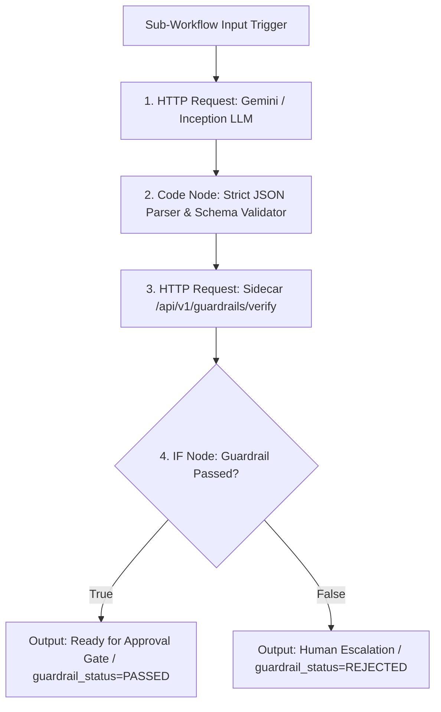

# Step 3 Plan: LLM Intent Classification & Hallucination Guardrail Sub-Workflow

## 1. Explicit Call Order Confirmation

The sub-workflow executes strictly in this linear sequence:



1. **Node 1 (LLM Reasoning):**
   - Receives clean email body + retrieved SQLite customer context JSON.
   - Calls Gemini `gemini-2.5-flash` (or Inception fallback) via HTTP Request node.
   - Enforces strict JSON output prompt.
2. **Node 2 (Parser & Validator):**
   - Strips any markdown fences (` ```json `).
   - Validates all 9 required schema fields and allowed enum values.
   - If invalid JSON or timeout: catches error and produces safe fallback object without crashing n8n.
3. **Node 3 (Deterministic Guardrail Call):**
   - Sends `POST http://insurance-triage-api:8008/api/v1/guardrails/verify` with `{ suggested_reply, customer_context }`.
   - Runs deterministic regex and amount checks against SQLite context.
4. **Node 4 (Branching IF Node):**
   - Checks `{{ $json.passed === true }}`.
   - **Branch True:** Attaches `guardrail_status: "PASSED"`, sets `escalation_needed: 0`, forwards reply for Step 4 Telegram approval.
   - **Branch False:** Attaches `guardrail_status: "REJECTED"`, captures `rejection_reason`, nullifies auto-reply, sets `escalation_needed: 1`, routes directly to Human Escalation.

*No unverified reply can ever bypass Node 3.*

---

## 2. Credentials & Network Configuration

- **Sidecar Network Address:** `http://insurance-triage-api:8008` (Docker container DNS on existing `hermes_net` network, verified working). Zero external exposure.
- **LLM Authentication:**
  - Standard n8n pattern: Uses `$env.GEMINI_API_KEY` in the URL query param:
    `https://generativelanguage.googleapis.com/v1beta/models/gemini-2.5-flash:generateContent?key={{ $env.GEMINI_API_KEY }}`
  - For exported GitHub workflow: replaced with placeholder `{{GEMINI_API_KEY}}`.
  - Inception API: Configurable OpenAI-compatible header `Authorization: Bearer {{ $env.INCEPTION_API_KEY }}`.

---

## 3. Strict LLM Output JSON Schema

The LLM prompt requires this exact contract:

```json
{
  "category": "Claims | Policy | Billing | Roadside | Support",
  "intent": "CLAIM_STATUS | NEW_CLAIM | CLAIM_DOCUMENTS | CLAIM_DELAY | CLAIM_APPROVAL | CLAIM_REJECTION | POLICY_DOCUMENT | POLICY_DETAILS | POLICY_EXPIRY | RENEWAL | RENEWAL_QUOTE | PREMIUM_QUERY | POLICY_CHANGE | VEHICLE_CHANGE | CANCELLATION | REFUND | PAYMENT | NO_CLAIM_BONUS | NETWORK_GARAGE | CASHLESS_CLAIM | ROADSIDE_ASSISTANCE | INSPECTION | GENERAL_QUERY | COMPLAINT | FRAUD_SUSPICION",
  "priority": "Low | Medium | High | Critical",
  "urgency_score": 1, // Integer between 1 and 5
  "sentiment": "Positive | Neutral | Frustrated | Angry",
  "escalation_needed": 0, // 0 or 1
  "summary": "1-2 sentence executive summary of the customer's request",
  "suggested_reply": "Professional, grounded response text addressed to customer",
  "routed_to": "Claims Desk | Underwriting | Billing | Roadside Assist | Grievance Team"
}
```

---

## 4. Resilience & Error Handling

To ensure a single malformed email or LLM API hiccup never halts the polling loop:
- **Node Settings:** Node 1 has `onError: "continueRegularOutput"`.
- **Code Node Catch-All:** If JSON parsing fails or the LLM returns HTTP 429/500:
  ```javascript
  return [{
    json: {
      category: "Support",
      intent: "GENERAL_QUERY",
      priority: "High",
      urgency_score: 4,
      sentiment: "Neutral",
      escalation_needed: 1,
      summary: "LLM classification failed or timed out. Routed for manual human review.",
      suggested_reply: "",
      routed_to: "Human Support Desk",
      guardrail_status: "BYPASS_ERROR",
      rejection_reason: "LLM response malformed or unavailable.",
      passed: false
    }
  }];
  ```
- Workflow never stops in an error state; it records the incident and continues polling.
