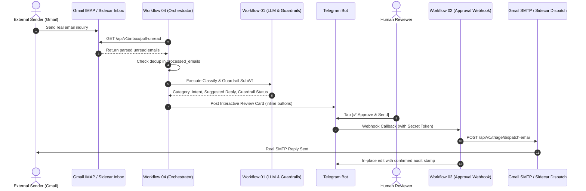

# Step 5 Walkthrough: Real Email Ingestion, Dedup & SMTP Dispatch Orchestrator

## 1. Objectives & Scope
- **IMAP Ingestion:** Automate polling of incoming emails from Gmail IMAP into n8n via `/api/v1/inbox/poll-unread`.
- **Deduplication:** Enforce strict idempotency and deduplication via `/api/v1/dedup/check-and-record` storing hashes in `processed_emails`.
- **Classification & Guardrails:** Pass real email content through `InsTriageSubWf01` using Gemini 2.5 Flash and deterministic SQLite context grounding guardrails.
- **Human-in-the-Loop Gate:** Render interactive card in Telegram reviewer bot with `[✅ Approve & Send]` and `[❌ Reject]` buttons.
- **Verified SMTP Send:** On human approval, send the grounded reply email via secure SMTP (`smtp.gmail.com:465`) and atomically update `reply_status = 'SENT'`.

---

## 2. Architecture & Orchestration Flow

---

## 3. Key Technical Challenges & Solutions (ADR-017)

1. **Telegram 64-Byte Callback Data Limit:**
   - *Problem:* Gmail RFC822 `Message-ID` headers are often 70+ bytes (e.g. `CAJB2TQh6RkUbrYDzih2yPrgVnyng7y2ayBL3wo_jqGiG+WPGKQ@mail.gmail.com`). Telegram rejects `callback_data` > 64 bytes with `Bad Request: BUTTON_DATA_INVALID`.
   - *Solution:* Switched to database primary key reference (`APP:<id>`, ~6 bytes). Added dual lookup `WHERE message_id = ? OR CAST(id AS TEXT) = ?` in FastAPI sidecar endpoints.

2. **n8n JSON Body Expression Escaping:**
   - *Problem:* In n8n HTTP Request node `typeVersion: 4.2`, multiline LLM suggestions containing quotes and newlines broke raw string-interpolated JSON.
   - *Solution:* Implemented intermediate Code nodes to construct payload objects cleanly and serialized with `jsonBody: "={{ JSON.stringify($json.payload) }}"`.

3. **Strict Dispatch State Boundary:**
   - Only the physical SMTP transmission marks `reply_status = 'SENT'`. Telegram approval only transitions `approval_status = 'APPROVED'`.

---

## 4. Empirical Verification & Evidence

- **Test Email Sender:** `tester@example.com`
- **Subject:** `Towing Support Needed for breakdowns`
- **Triage Result Record:**
  - `id`: 17
  - `message_id`: `CAJB2TQh6RkUbrYDzih2yPrgVnyng7y2ayBL3wo_jqGiG+WPGKQ@mail.gmail.com`
  - `category`: `Roadside`
  - `intent`: `ROADSIDE_ASSISTANCE`
  - `priority`: `Critical`
  - `guardrail_status`: `PASSED`
  - `approval_status`: `APPROVED`
  - `reply_status`: `SENT`
  - `telegram_message_id`: 6
- **Real SMTP Send:** Status `200 OK`, `{"status":"success","message_id":"17","recipient":"tester@example.com","reply_status":"SENT"}`.
- **Telegram Audit Stamp:** Edited in-place to display:
  `✅ APPROVED & SENT by Reviewer (2026-09-23 12:58:59 UTC)`
  `Status: Reply Dispatched via SMTP (reply_status: SENT)`.

---

## 5. Step 5 Refinement & Hardening (ADR-018)

- **Swallowed Exception Fix:** Refactored `api/main.py:dispatch_email` with `try...finally: conn.close()` and clean `HTTPException` re-raising. Verified 404 (not found) and 400 (not approved).
- **Dead Code Cleanup:** Removed unused endpoint `mark_reply_sent`.
- **Truthful Audit Sequencing in Workflow 02:**
  - Fast transient banner via `answerCallbackQuery` unblocks reviewer UI immediately.
  - Gated dispatch behind an explicit IF node (`action === 'APPROVE'`).
  - `REJECT` actions update Telegram card to `❌ REJECTED` with zero calls to SMTP.
  - `APPROVE` actions call `Dispatch Approved Email`. Only on confirmed delivery success does the card edit to `✅ APPROVED & SENT`.
  - On dispatch failure, the card displays `⚠️ APPROVED by Reviewer ... Status: SMTP DISPATCH FAILED (reply_status: NOT_SENT)`.
  - Negative SMTP test verified that `reply_status` in SQLite stays `NOT_SENT` if dispatch fails.
- **Global Production Standards:**
  - Network timeouts: Enforced `timeout=15` on `IMAP4_SSL`, `SMTP_SSL`, and `SMTP`.
  - Email header injection: Outbound subjects sanitized against CRLF (`\r`, `\n`).
  - SQLite WAL: Enabled `PRAGMA journal_mode=WAL; PRAGMA synchronous=NORMAL;` with `timeout=30.0` on connection.
  - Static analysis: Automated with `scripts/run_lint.sh` (`ruff check api/`).

